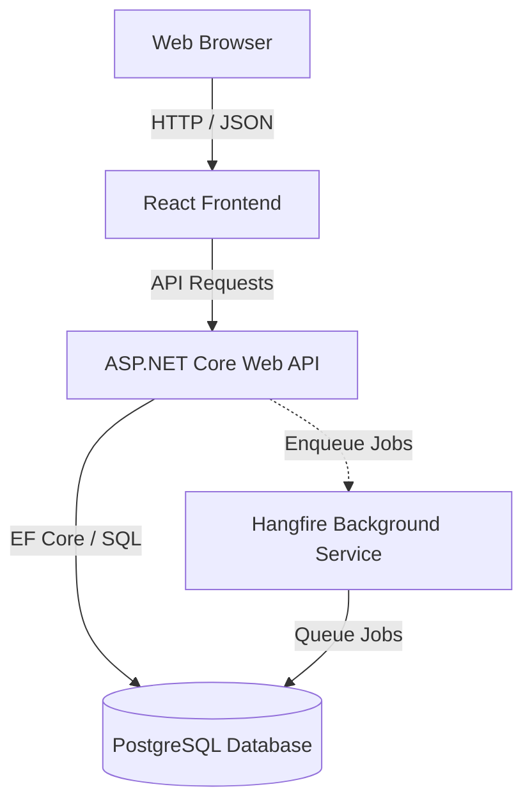

# ADWAIS

A multi-tenant platform for e-commerce analytics, endpoint monitoring, and team communication.

[Live interactive demo](https://adwais.marmenlind.com)

## Architecture

A monorepo managed with pnpm workspaces.



## Directory structure

- `/apps`
  - `/apps/web` - React 19, TypeScript, Vite, Tailwind CSS v3 frontend.
  - `/apps/server` - .NET solution and local PostgreSQL Compose file.
  - `/apps/server/ADWAIS` - ASP.NET Core solution (`src/Api`, `src/Application`, `src/Domain`, `src/Infrastructure`, `tests`).
- `/packages`
  - `/packages/types` - TypeScript types generated from the OpenAPI spec.
- `/docs` - Documentation and the generated OpenAPI spec.
- `/infrastructure` - nginx config baked into the frontend image.
- `/scripts` - Helper scripts.

Other root files: `pnpm-workspace.yaml`, `.env.example`.

Docs: [authentication](docs/authentication.md), [Shopify order source](docs/shopify-integration.md).

## Prerequisites

- Node.js >= 24.15.0
- pnpm >= 11.5.0
- Corepack enabled
- .NET SDK 10.0
- PostgreSQL or Docker

## Quickstart

1. Install dependencies:

```bash
corepack enable
pnpm install
```

2. Configure the environment.

The frontend reads `apps/web/.env.local`. The API reads ASP.NET configuration at runtime.

| File | Required | Contains |
|---|---|---|
| `apps/web/.env.local` | Yes | OIDC settings, SSO branding, demo mode flag |
| `apps/server/ADWAIS/src/Api/appsettings.Development.json` | Tracked | Local database, auth, feature defaults |
| `apps/server/ADWAIS/src/.env` | No | Local overrides |

Copy `apps/web/.env-example` to `apps/web/.env.local` and edit it. Do not put `VITE_*` values in a root `.env.local`. The Vite project is scoped to `apps/web`. Vite fails early when an env file has a UTF-8 BOM.

Demo mode:

```env
# apps/web/.env.local
VITE_DEMO_MODE=true
```

```json
// apps/server/ADWAIS/src/Api/appsettings.Development.json
"EnableDemoAccess": true
```

Demo mode adds a login option that requests a Viewer token from `/api/demo/token`. OIDC settings are not needed in demo mode.

Outside demo mode, set `VITE_OIDC_AUTHORITY` and `VITE_OIDC_CLIENT_ID` in the frontend. Set `Authentication:OidcAuthority` and `Authentication:OidcAudience` in the API.

3. Start the database:

```bash
pnpm db:up
```

4. Apply migrations:

```bash
pnpm migration:update
```

5. Start the frontend:

```bash
pnpm dev:web
```

6. Start the backend:

```bash
pnpm dev:api
```

`EnableRuntimeDataSeeding: true` is already set in `appsettings.Development.json`. Demo monitors use negative local IDs and are never sent to UptimeRobot.

## pnpm scripts

| Script | What it does |
|---|---|
| `pnpm dev:web` | Start the frontend dev server |
| `pnpm dev:api` | Start the backend API |
| `pnpm dev:api:watch` | Start the backend API with hot reload |
| `pnpm codegen` | Regenerate the OpenAPI spec and TypeScript types |
| `pnpm db:up` | Start the local PostgreSQL container |
| `pnpm db:down` | Stop the local PostgreSQL container |
| `pnpm migration:add <Name>` | Create an EF Core migration (stop `dev:api` first) |
| `pnpm migration:update` | Apply pending migrations |
| `pnpm migration:remove` | Remove the last unapplied migration |
| `pnpm migration:list` | List migrations and their status |
| `pnpm dev:web:build` | Build the frontend for production |
| `pnpm dev:web:preview` | Preview the frontend build |

## Code generation

The API project writes `docs/openapi/v1.json` on build. `orval` reads it and generates TypeScript types (`packages/types/generated`) and API hooks (`apps/web/src/api/generated/endpoints.ts`).

Run after API changes:

```bash
pnpm codegen
```

## Production Deployment

Production deployment is manual and component-selective, and runs on a
**self-hosted GitHub Actions runner** (label `adwais-prod`) on the production
host. In GitHub, open **Actions → Deploy production → Run workflow**, select the
`main` branch, and choose one target:

- `frontend`, `backend`, or `infrastructure`
- `restart-api`, `restart-stack`, or `reload-nginx`
- `all`

Application images are **built locally on the runner** (no container registry):
`web` is an `nginx:alpine` image serving the SPA with
`infrastructure/nginx/default.conf` baked in (it proxies `/api`, `/swagger`,
`/openapi`, and `/hangfire` to the API container); `api` is the ASP.NET Core
image. Only `db` and `cloudflared` are pulled from Docker Hub. No SSH is used.
The runner has local Docker access, and no application ports are published on
the host. Cloudflare Tunnel is the only public entry point. The one-time server
preparation (runner install, `/opt/adwais`, tunnel setup) is performed manually
on the host.

The `production` GitHub environment must define these runtime secrets:
`DB_PASSWORD`, `MOTASTIC_API_KEY`, `NEWSLETTER_API_KEY`, `KIOSK_JWT_SECRET`, and
`CLOUDFLARE_TUNNEL_TOKEN`.

The workflow reads these GitHub Actions variables: `OIDC_AUTHORITY`,
`OIDC_AUDIENCE`, `OIDC_CLIENT_ID` (all three required unless `DEMO_MODE=true`),
optional `OIDC_SCOPE`, optional `SSO_BUTTON_LABEL`, optional `SSO_BUTTON_LOGO_URL`,
`DEMO_MODE` (default `false`), `ENABLE_RUNTIME_DATA_SEEDING` (default `true`), and
`CLOUDFLARED_IMAGE_TAG` (default `latest`).

The workflow writes the resulting Compose environment to `/opt/adwais/.env`
(mode `0600`). That file is the production source of truth. No `.env.production`
file is used by the GitHub deployment. Compose maps the unprefixed values into
frontend `VITE_*` build arguments and API `Authentication__*` runtime variables.

`Frontend` and `Backend` targets reuse the existing `/opt/adwais/.env`; run
`Infrastructure` or `All` first when that file has not been created yet or when
GitHub configuration variables have changed. Use `All` when changing `DEMO_MODE`,
because the API must restart and the frontend must be rebuilt with the new
`VITE_DEMO_MODE` value. Because the nginx configuration is baked into the web
image, changes to `infrastructure/nginx/default.conf` require a `frontend`
deployment; `reload-nginx` only validates and reloads the configuration already
inside the running container.

## License

This repository is licensed under the MIT License. See [LICENSE](./LICENSE) for the full terms.

The MIT copyright and permission notices must remain in source distributions
and substantial portions of the software.

## Contributing

By contributing, you agree to the terms in [CONTRIBUTING.md](./CONTRIBUTING.md).

## Acknowledgements

Started as a university project. Contributions from David Vilselius, Francisco Vigo Flores, Erik Falk, and Christoffer Bohm.
